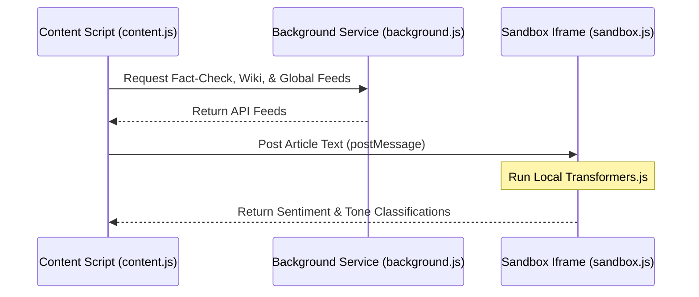

# Argus

Argus is a serverless, local-first, and privacy-centric news reality-check and credibility browser extension. It performs real-time bias detection, language auditing, entity verification, and fact-check lookup directly on your device, ensuring no personal data or article history leaves your browser.

---

## Key Features

1. **On-Device Local AI Tone Analysis**
   - Uses **Transformers.js** (`@xenova/transformers`) to run machine learning models (specifically `distilbert-base-uncased-finetuned-sst-2-english` text classifier) directly in the browser.
   - Runs inside a secure, sandboxed iframe (`sandbox.html` / `sandbox.js`) to satisfy strict Chrome Extension Content Security Policies (CSP) and disable heavy memory-caching constraints.
   
2. **Language & Text Audit**
   - Scans text for emotional/loaded vocabulary, opinion markers, and hedging words (e.g., *allegedly*, *reportedly*).
   - Generates a **Sourcing Score** based on direct quotes, attributions, and data/study references.
   - Computes a total **Trust Score** and labels the article's risk level (*High Caution*, *Read Critically*, or *Appears Well-Sourced*).

3. **Live Fact-Check Integration**
   - Automatically queries Google News RSS feeds to check for verified debunking or corroboration reports from trusted publishers like Snopes, PolitiFact, and FactCheck.org.

4. **Wikipedia Cross-Reference**
   - Automatically extracts prominent entities from the article text and cross-references them with Wikipedia APIs to check if they exist, summarizing verified entities or flagging unverified ones.

5. **Global Lens**
   - Aggregates articles covering the same story across other media platforms using Google News RSS feeds, allowing users to see how different outlets frame the same topic.

6. **Corporate DNA**
   - Maps news websites to their parent companies, funding sources, and verified status using a local repository (`database.json`) derived from Wikidata.

---

## Directory Structure

```text
├── argus-extension/          # Chrome Extension (Manifest V3) Source
│   ├── manifest.json         # Extension manifest with sandbox & permissions configurations
│   ├── background.js         # Service worker facilitating fetch queries & cross-origin messaging
│   ├── content.js            # Active tab UI overlay builder and NLP text heuristics
│   ├── ui.css                # Visual theme styling (dark glassmorphism, indicators)
│   ├── sandbox.html/js       # Secure sandbox context holding local Transformers.js model
│   ├── worker.js             # Local AI web worker wrapper
│   └── database.json         # Local offline domain trust and ownership records
│
└── pipeline/                 # Automated data pipelines and tests
    ├── requirements.txt      # Python dependencies
    ├── update_database.py    # SPARQL Wikidata query script to build database.json
    ├── update_bbc.py         # Utility script to apply manual database overrides
    └── verify_pr.py          # Automated CI script to validate community PR sources
```

---

## Installation & Setup

### Installing the Browser Extension
1. Clone this repository locally.
2. Open Google Chrome (or any Chromium-based browser) and navigate to `chrome://extensions/`.
3. Toggle the **Developer mode** switch in the top-right corner.
4. Click **Load unpacked** in the top-left corner.
5. Select the `argus-extension` folder from this repository.
6. Click the extension icon on any news article page to run a deep analysis.

### Running the Data Pipeline
The python pipeline constructs and verifies the local domain database:

1. Install requirements:
   ```bash
   pip install -r pipeline/requirements.txt
   ```
2. Run the Wikidata updater:
   ```bash
   python pipeline/update_database.py
   ```
3. Run the PR source verification checks locally:
   ```bash
   python pipeline/verify_pr.py
   ```

---

## Security & Privacy Architecture
Chrome Extension Content Security Policies (CSP) forbid executing external code (`eval` or external network WASM modules) within typical extension popups. Argus resolves this by delegating ONNX runtime execution to a sandboxed environment (`sandbox.html`). 

Communication flows as follows:

No article text or user browsing habits are ever uploaded to any third-party analytics servers.
